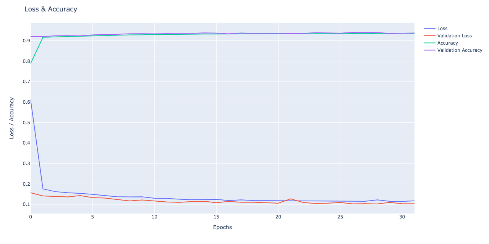

# Which mountain is this



| Validation loss | Validation accuracy |
| --------------- | ------------------- |
| 10%             | 94%                 |


# Contents

- [Description](#Description)
- [Dataset](#Dataset)
- [Workflow](#Description)


# Description

[(Back to top)](#Which-mountain-is-this)

For my final project at Ironhack I had to create a Machine Learning project.
As a mountain lover I decided to make an image recognization system.
This allows the computer to recognize pictures of mountains.


# Dataset

[(Back to top)](#Which-mountain-is-this)

Wikipedia (List of mountains by elevation):
https://en.wikipedia.org/wiki/List_of_mountains_by_elevation

For the training data I used Google images search results.


# Workflow

[(Back to top)](#Which-mountain-is-this)

First I started to look for a dataset that would contain all the highest mountains in the world.
At wikipedia I found the 'List of mountains by elevation' page.
This page contains multiple tables containing mountains of certain sizes (8000, 7000, etc).
It also contains the height, mountain range and location. I needed only the height for this project, so I scraped this.
For the coordinates of the mountains I needed to go to the individual pages of the mountains.
At these individual pages there is a link to coordinates.
From there I scraped the coordinates and put everything together in a dataframe.

This dataset is then used to download images for the training.
For this project the dataset is limited to 10 mountains and 10000 per mountain.
This restriction has to do with computation time.

For building the dataset I converted the images to black and white.
This saves a lot of disk space and during the training this also saves an immense amount of memory and computation time.
The pictures are resized to a square of 256 pixels.
This allows a lot of detail for the individual mountains.
I increased the image size compared to more common used sizes.

For training the model I used Keras.
This was because I could use the PlaidML framework which allow to use AMD GPU’s.
For this project I was using macOS on a Mac Pro (2013).
This Mac has a duel GPU configuration which would speedup the training.

For the model I used this configuration:

```Python
model = Sequential()

model.add(Conv2D(filters=32, kernel_size=(5, 5), activation="relu", input_shape=X.shape[1:]))
model.add(MaxPooling2D(pool_size=(2, 2)))
model.add(Dropout(0.25))

model.add(Conv2D(filters=64, kernel_size=(5, 5), activation='relu'))
model.add(MaxPooling2D(pool_size=(2, 2)))
model.add(Dropout(0.25))

model.add(Conv2D(filters=128, kernel_size=(5, 5), activation='relu'))
model.add(MaxPooling2D(pool_size=(2, 2)))
model.add(Dropout(0.25))

model.add(Flatten())

model.add(Dense(256, activation='relu'))
model.add(Dropout(0.5))

model.add(Dense(len(y[1]), activation='softmax'))
```

For the compiling I used these settings:

```Python
batch_size = 64
epochs = 100

model.compile(optimizer='adam', loss='categorical_crossentropy', metrics=['accuracy'])

history = model.fit(x=X_train, y=y_train,
                    batch_size=batch_size,
                    epochs=epochs,
                    verbose=1,
                    callbacks=[early_stopping, model_checkpoint],
                    validation_data=(X_test, y_test))
```

After the 32 Epochs (this would stop running the moment the validation loss wouldn’t decrease anymore) I created the following graph:


After evaluating the model I got this score:

| Validation loss | Validation accuracy |
| --------------- | ------------------- |
| 10%             | 94%                 |